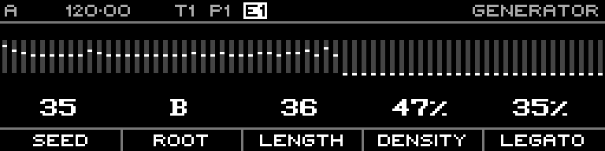
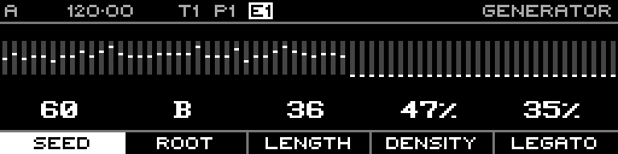
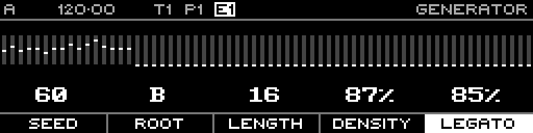
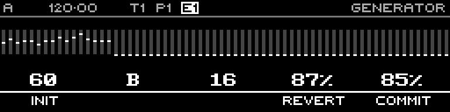

<!-- SPDX-FileCopyrightText: 2026 Axel Napolitano -->
<!-- SPDX-License-Identifier: CC-BY-NC-4.0 -->

# Acid Bassline Generator

The Acid Bassline generator creates a deterministic Note-sequence proposal from a small set of musical controls. The generator is opened from the Note step editor, previewed live and then either committed or reverted.

## Select the generator

Open the Note step-editor context menu with **Shift + Page**, choose **Generators**, select **Acid Bassline**, and confirm the selection.

## Generator screen

The generator exposes five function-key parameters:

- **Seed** — deterministic generator seed.
- **Root** — root note from C through B.
- **Length** — generated phrase length.
- **Density** — gate/activity density from 0–100%.
- **Legato** — legato/slide mixture from 0–100%.

Each parameter has its own reference capture:

## Commit or revert

Hold **Shift + Page** while the generator is open. The context menu exposes **Init**, **Revert** and **Commit**. Commit accepts the current generated sequence and returns to the Note step editor; Revert restores the pre-generator state.

## Screen reference

- [Generator selection](../../screens/generators/generator-select-acid-bassline.md)
- [Generator overview](../../screens/generators/acid-bassline-generator.md)
- [Seed](../../screens/generators/acid-bassline-seed.md)
- [Root Note](../../screens/generators/acid-bassline-root.md)
- [Length](../../screens/generators/acid-bassline-length.md)
- [Density](../../screens/generators/acid-bassline-density.md)
- [Legato](../../screens/generators/acid-bassline-legato.md)
- [Commit menu](../../screens/generators/acid-bassline-commit-menu.md)
- [Committed result](../../screens/generators/acid-bassline-committed.md)

From Munich with 
