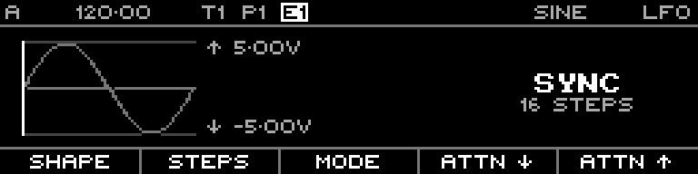
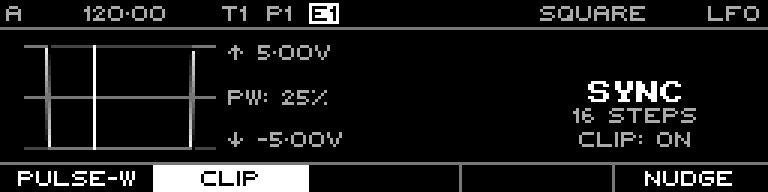

<!-- SPDX-FileCopyrightText: 2026 Axel Napolitano -->
<!-- SPDX-License-Identifier: CC-BY-NC-4.0 -->

# LFO Track

The Styr LFO track generates continuous modulation CV from a dedicated waveform page. Unlike Note and Curve tracks, it is not a 64-step data editor: the page exposes waveform, rate/mode and voltage limits directly, with secondary functions on `SHIFT`.

## Documentation fixture

All LFO reference screenshots force the resolved output range to **-5.00 V ... +5.00 V**. The capture tool writes both the base and routed value lanes and explicitly clears LFO routing state before capture. This prevents an earlier Routing-page fixture from silently replacing the visible Min/Max values with a smaller routed range.

## Normal function layer

In **Sync** mode the five function keys are:

- **Shape** — waveform selection;
- **Steps** — synchronised cycle length, 1–64 steps;
- **Mode** — Sync or Free;
- **Min** — lower output limit, -5.00 V ... +5.00 V;
- **Max** — upper output limit, -5.00 V ... +5.00 V.

In **Free** mode the second function changes from Steps to **Frequency**, stored in 0.01 Hz increments from 0.00 Hz to 20.00 Hz.

## Waveforms

Each shape has its own deterministic reference capture at the full ±5 V documentation range:

- [Sine](../../screens/lfo/lfo-shape-sine.md)
- [Triangle](../../screens/lfo/lfo-shape-triangle.md)
- [Ramp Up](../../screens/lfo/lfo-shape-ramp-up.md)
- [Ramp Down](../../screens/lfo/lfo-shape-ramp-down.md)
- [Square](../../screens/lfo/lfo-shape-square.md)
- [Random](../../screens/lfo/lfo-shape-random.md)
- [Smoothed Random](../../screens/lfo/lfo-shape-smoothed-random.md)
- [Noise](../../screens/lfo/lfo-shape-noise.md)

The Noise painter uses pseudo-random values while rendering. The documentation generator resets its random seed before the Noise capture so repeated runs remain reproducible.

## Shift layer

Hold `SHIFT` to expose the secondary controls:

- **Pulse Width** — available for Square, 0–100%;
- **Clip** — Boolean clipping control;
- **Nudge** — circular Sync offset for Sine, Triangle, Ramp Up, Ramp Down and Square.

## Screen reference

- [Sync overview](../../screens/lfo/lfo-sync.md)
- [Shape selector](../../screens/lfo/lfo-shape.md)
- [Steps](../../screens/lfo/lfo-steps.md)
- [Mode](../../screens/lfo/lfo-mode.md)
- [Min](../../screens/lfo/lfo-min.md)
- [Max](../../screens/lfo/lfo-max.md)
- [Free overview](../../screens/lfo/lfo-free.md)
- [Frequency](../../screens/lfo/lfo-frequency.md)
- [Shift layer](../../screens/lfo/lfo-shift.md)
- [Pulse Width](../../screens/lfo/lfo-pulse-width.md)
- [Clip](../../screens/lfo/lfo-clip.md)
- [Nudge](../../screens/lfo/lfo-nudge.md)

From Munich with 
