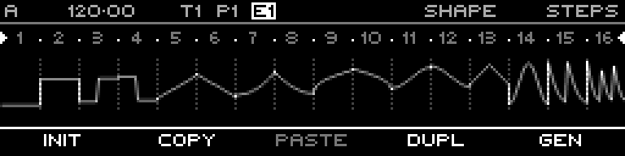

<!-- SPDX-FileCopyrightText: 2026 Axel Napolitano -->
<!-- SPDX-License-Identifier: CC-BY-NC-4.0 -->

# Curve Steps — Context Menu

## Function

Provides sequence actions from the Curve step editor, including generator access where the selected layer supports it.

## Access

On Curve Steps, hold `SHIFT` + `PAGE`.

## Operation

Choose the desired context action using the labeled function key.

From Munich with 
