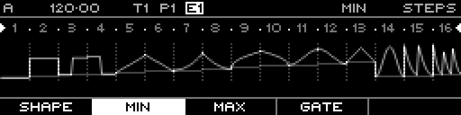

<!-- SPDX-FileCopyrightText: 2026 Axel Napolitano -->
<!-- SPDX-License-Identifier: CC-BY-NC-4.0 -->

# Curve Steps — Min

## Function

Sets the lower voltage/value endpoint for each curve step.

## Access

Select a Curve track, open `PAGE` + `S1` (`STEPS`), then select this layer with the corresponding function key.

## Operation

Hold one or more steps and turn the encoder. `SHIFT` or pressing the encoder enables finer adjustment; holding the corresponding function key can offset Min/Max together.

## Notes

Curve sequences use the same 64-step/16-step-section editing model as Note sequences, but their primary output is a continuously shaped CV signal.

From Munich with 
