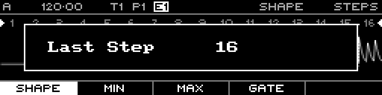

<!-- SPDX-FileCopyrightText: 2026 Axel Napolitano -->
<!-- SPDX-License-Identifier: CC-BY-NC-4.0 -->

# Curve Quick Edit — Last Step

## Function

Sets the last step of the active playback range.

## Access

From Curve Steps, hold `PAGE` + `S10`.

## Operation

Keep the chord active and turn the encoder to change the value without leaving the step editor.

From Munich with 
