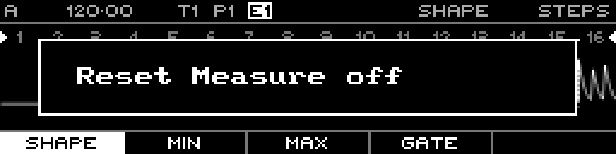

<!-- SPDX-FileCopyrightText: 2026 Axel Napolitano -->
<!-- SPDX-License-Identifier: CC-BY-NC-4.0 -->

# Curve Quick Edit — Reset Measure

## Function

Sets the measure interval for sequence reset.

## Access

From Curve Steps, hold `PAGE` + `S13`.

## Operation

Keep the chord active and turn the encoder to change the value without leaving the step editor.

From Munich with 
