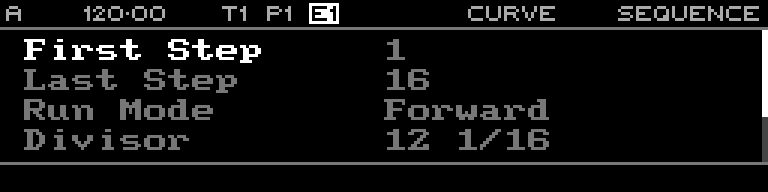

<!-- SPDX-FileCopyrightText: 2026 Axel Napolitano -->
<!-- SPDX-License-Identifier: CC-BY-NC-4.0 -->

# Curve Sequence

## Function

Configures playback parameters for the selected Curve sequence.

## Access

Select a Curve track and press `PAGE` + `S2` (`SEQ`).

## Operation

Sequence controls include First Step, Last Step, Run Mode, Divisor, Reset Measure and output voltage Range.

From Munich with 
