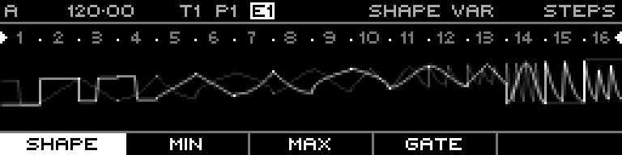

<!-- SPDX-FileCopyrightText: 2026 Axel Napolitano -->
<!-- SPDX-License-Identifier: CC-BY-NC-4.0 -->

# Curve Steps — Shape Variation

## Function

Selects an alternate curve shape that may replace the primary shape.

## Access

Select a Curve track, open `PAGE` + `S1` (`STEPS`), then select this layer with the corresponding function key.

## Operation

Hold one or more steps and turn the encoder.

## Notes

Curve sequences use the same 64-step/16-step-section editing model as Note sequences, but their primary output is a continuously shaped CV signal.

From Munich with 
