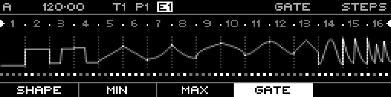

<!-- SPDX-FileCopyrightText: 2026 Axel Napolitano -->
<!-- SPDX-License-Identifier: CC-BY-NC-4.0 -->

# Curve Steps — Shift + Gate

## Function

Jumps directly to the primary **Gate** layer instead of cycling within its function group.

## Access

On Curve Steps, hold `SHIFT` and press `F4`.

## Operation

Release `SHIFT` after the layer is selected and continue normal step editing.

From Munich with 
