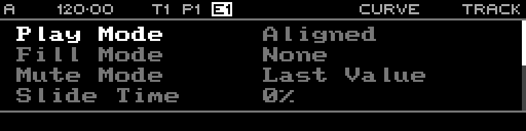

<!-- SPDX-FileCopyrightText: 2026 Axel Napolitano -->
<!-- SPDX-License-Identifier: CC-BY-NC-4.0 -->

# Curve Track

## Function

Configures track-wide playback and CV behaviour for a Curve track.

## Access

Select a Curve track and press `PAGE` + `S3` (`TRACK`).

## Operation

Track controls include play/fill mode, mute behaviour, slide/slew time, CV offset, rotation and probability biases.

From Munich with 
