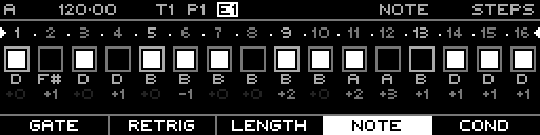

<!-- SPDX-FileCopyrightText: 2026 Axel Napolitano -->
<!-- SPDX-License-Identifier: CC-BY-NC-4.0 -->

# Acid Bassline — Committed Result

## Function

Shows the Note sequence after the generated bassline has been accepted.

## Access

Choose **Commit** in the generator context menu.

## Operation

The preview becomes ordinary editable Note-sequence data after Commit.

From Munich with 
