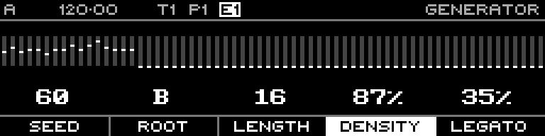

<!-- SPDX-FileCopyrightText: 2026 Axel Napolitano -->
<!-- SPDX-License-Identifier: CC-BY-NC-4.0 -->

# Acid Bassline — Density

## Function

Controls how densely the generated phrase is populated.

## Access

Hold **Density** and turn the encoder.

## Operation

Range is 0–100%. Higher values admit more generated gate events.

From Munich with 
