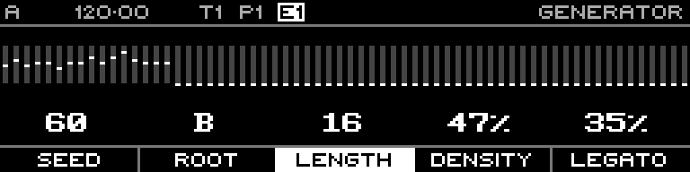

<!-- SPDX-FileCopyrightText: 2026 Axel Napolitano -->
<!-- SPDX-License-Identifier: CC-BY-NC-4.0 -->

# Acid Bassline — Length

## Function

Sets the generated phrase length.

## Access

Hold **Length** and turn the encoder.

## Operation

Range is 1–64 steps; coarse editing moves through larger musically useful blocks.

From Munich with 
