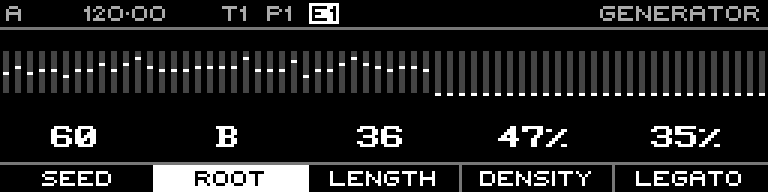

<!-- SPDX-FileCopyrightText: 2026 Axel Napolitano -->
<!-- SPDX-License-Identifier: CC-BY-NC-4.0 -->

# Acid Bassline — Root

## Function

Selects the harmonic root used by the generated phrase.

## Access

Hold **Root** and turn the encoder.

## Operation

Root is limited to the 12 chromatic pitch classes C through B.

From Munich with 
