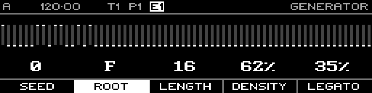

<!-- SPDX-FileCopyrightText: 2026 Axel Napolitano -->
<!-- SPDX-License-Identifier: CC-BY-NC-4.0 -->

# Euclidean — Beats

## Function

Sets the number of active pulses distributed across the Euclidean cycle.

## Access

Hold **Beats** and turn the encoder.

## Operation

If Beats exceeds Steps, the rhythm algorithm effectively limits active pulses to the available steps.

From Munich with 
