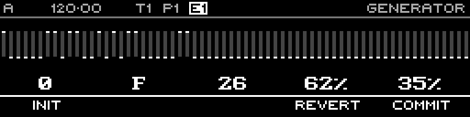

<!-- SPDX-FileCopyrightText: 2026 Axel Napolitano -->
<!-- SPDX-License-Identifier: CC-BY-NC-4.0 -->

# Euclidean — Commit Menu

## Function

Provides Init, Revert and Commit actions for the live generator preview.

## Access

While Euclidean is open, hold `SHIFT` + `PAGE`.

## Operation

**Commit** accepts the generated layer. **Revert** restores the pre-generator sequence. **Init** resets generator parameters.

From Munich with 
