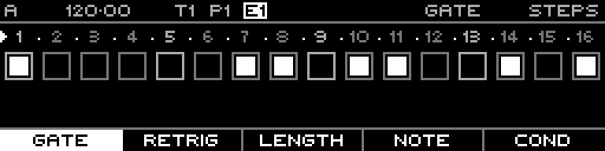

<!-- SPDX-FileCopyrightText: 2026 Axel Napolitano -->
<!-- SPDX-License-Identifier: CC-BY-NC-4.0 -->

# Euclidean — Committed Result

## Function

Shows the step layer after the Euclidean preview has been accepted.

## Access

Choose **Commit** from the generator context menu.

## Operation

The generator closes and normal step editing resumes with the generated values stored in the sequence.

From Munich with 
