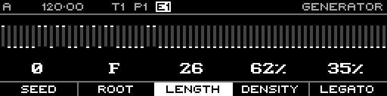

<!-- SPDX-FileCopyrightText: 2026 Axel Napolitano -->
<!-- SPDX-License-Identifier: CC-BY-NC-4.0 -->

# Euclidean — Offset

## Function

Rotates the generated Euclidean pattern.

## Access

Hold **Offset** and turn the encoder.

## Operation

Use Offset to move the same pulse distribution to a different phase/starting position.

From Munich with 
