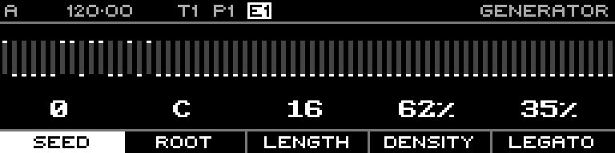

<!-- SPDX-FileCopyrightText: 2026 Axel Napolitano -->
<!-- SPDX-License-Identifier: CC-BY-NC-4.0 -->

# Euclidean — Steps

## Function

Sets the generated pattern length.

## Access

Hold **Steps** on the Euclidean generator page and turn the encoder.

## Operation

Valid length is 1–64 steps.

From Munich with 
