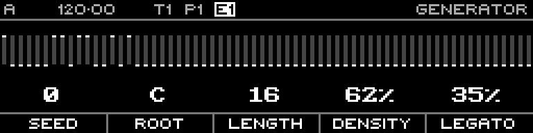

<!-- SPDX-FileCopyrightText: 2026 Axel Napolitano -->
<!-- SPDX-License-Identifier: CC-BY-NC-4.0 -->

# Generator — Euclidean

## Function

Distributes a chosen number of beats as evenly as possible across a chosen number of steps.

## Access

Confirm **Euclidean** in the generator selector.

## Operation

The generator edits a preview until Commit. Parameters are Steps, Beats and Offset.

From Munich with 
