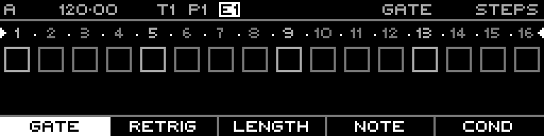

<!-- SPDX-FileCopyrightText: 2026 Axel Napolitano -->
<!-- SPDX-License-Identifier: CC-BY-NC-4.0 -->

# Generator — Init Layer Result

## Function

Shows the selected layer after Init Layer has reset it to defaults.

## Access

Confirm **Init Layer** in the generator selector.

## Operation

Because the action is immediate there is no Commit/Revert stage.

From Munich with 
