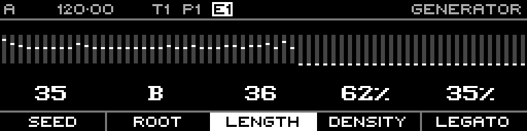

<!-- SPDX-FileCopyrightText: 2026 Axel Napolitano -->
<!-- SPDX-License-Identifier: CC-BY-NC-4.0 -->

# Random — Bias

## Function

Offsets the generated distribution before scaling/clamping.

## Access

Hold **Bias** and turn the encoder.

## Operation

Range is -10 through +10.

From Munich with 
