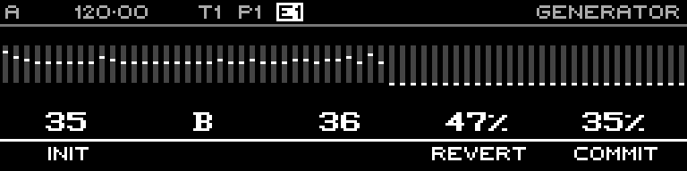

<!-- SPDX-FileCopyrightText: 2026 Axel Napolitano -->
<!-- SPDX-License-Identifier: CC-BY-NC-4.0 -->

# Random — Commit Menu

## Function

Provides Init, Revert and Commit actions for the Random preview.

## Access

While Random is open, hold `SHIFT` + `PAGE`.

## Operation

Commit accepts the preview; Revert restores the original layer; Init resets generator parameters.

From Munich with 
