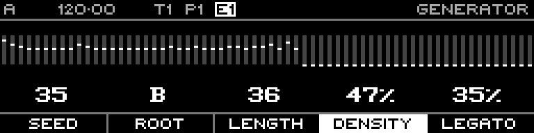

<!-- SPDX-FileCopyrightText: 2026 Axel Napolitano -->
<!-- SPDX-License-Identifier: CC-BY-NC-4.0 -->

# Random — Scale

## Function

Expands or contracts the generated value range around its centre.

## Access

Hold **Scale** and turn the encoder.

## Operation

Range is 0–100 in the current implementation.

From Munich with 
