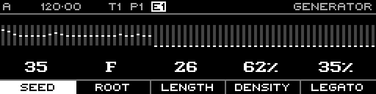

<!-- SPDX-FileCopyrightText: 2026 Axel Napolitano -->
<!-- SPDX-License-Identifier: CC-BY-NC-4.0 -->

# Random — Seed

## Function

Selects the pseudo-random seed, making a given parameter set reproducible.

## Access

Hold **Seed** and turn the encoder.

## Operation

Seed is clamped to 0–1000 in the current implementation.

From Munich with 
