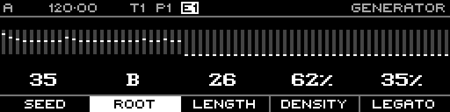

<!-- SPDX-FileCopyrightText: 2026 Axel Napolitano -->
<!-- SPDX-License-Identifier: CC-BY-NC-4.0 -->

# Random — Smooth

## Function

Repeatedly smooths neighbouring generated values.

## Access

Hold **Smooth** and turn the encoder.

## Operation

Range is 0–10 smoothing iterations.

From Munich with 
