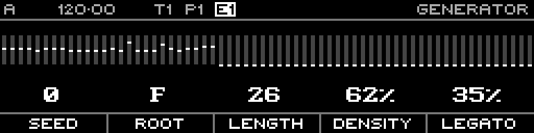

<!-- SPDX-FileCopyrightText: 2026 Axel Napolitano -->
<!-- SPDX-License-Identifier: CC-BY-NC-4.0 -->

# Generator — Random

## Function

Generates deterministic pseudo-random values for the selected layer.

## Access

Confirm **Random** in the generator selector.

## Operation

Parameters are Seed, Smooth, Bias and Scale. The preview changes immediately as parameters are edited.

From Munich with 
