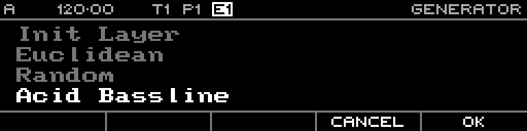

<!-- SPDX-FileCopyrightText: 2026 Axel Napolitano -->
<!-- SPDX-License-Identifier: CC-BY-NC-4.0 -->

# Generator Selection — Euclidean

## Function

Selects the Euclidean rhythm generator.

## Access

Open the step-editor context menu, choose **Generate**, then select **Euclidean**.

## Operation

Confirm to open the live generator preview.

From Munich with 
