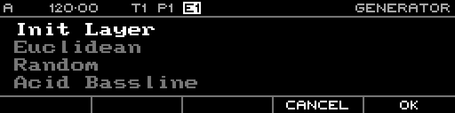

<!-- SPDX-FileCopyrightText: 2026 Axel Napolitano -->
<!-- SPDX-License-Identifier: CC-BY-NC-4.0 -->

# Generator Selection — Init Layer

## Function

Selects the immediate layer-initialisation action.

## Access

From Note/Curve Steps, hold `SHIFT` + `PAGE`, choose **Generate**, select **Init Layer**, then confirm.

## Operation

Init Layer clears only the currently selected layer and returns directly to the step editor; it has no parameter-preview page.

From Munich with 
