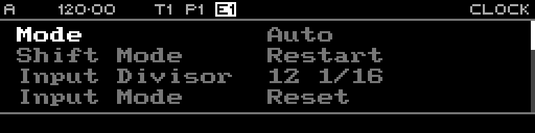

<!-- SPDX-FileCopyrightText: 2026 Axel Napolitano -->
<!-- SPDX-License-Identifier: CC-BY-NC-4.0 -->

# Clock Setup

## Function

Configures clock source and timing behaviour for the sequencer.

## Access

Press `PAGE` + `TEMP`/Clock to open the Clock page.

## Operation

Use the encoder to select and edit clock parameters. The active clock mode is also reflected in the display header.

From Munich with 
