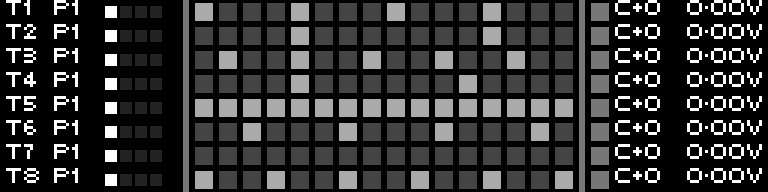

<!-- SPDX-FileCopyrightText: 2026 Axel Napolitano -->
<!-- SPDX-License-Identifier: CC-BY-NC-4.0 -->

# Overview

## Function

Provides a compact status view across all eight tracks so you can check pattern assignment, activity, and the current sequence slice without opening each track individually.

## Access

Press `PAGE` + `PREV` to open Overview.

## Operation

Each row shows the track number, its current pattern, and optional gate/note/voltage readouts.

- Note and Curve tracks draw a compact lane view for the current 16-step slice.
- The small four-block map at the left of each lane shows which 16-step slice is active within a 64-step sequence.
- When **Notes** is enabled, Note tracks can show note names directly in the overview.
- Other track types still show their track/pattern status even though they do not draw a step lane here.

`SHIFT` + `PAGE` opens a context menu that toggles the **Maps**, **Gates**, **Notes**, and **Voltages** columns.

From Munich with 
