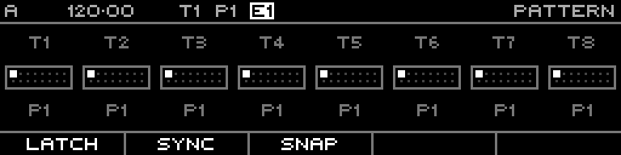

<!-- SPDX-FileCopyrightText: 2026 Axel Napolitano -->
<!-- SPDX-License-Identifier: CC-BY-NC-4.0 -->

# Pattern

## Function

Selects and manages the 16 project patterns, including play/edit context and request timing.

## Access

Hold `PATT` for temporary access, or use page navigation to open Pattern.

## Operation

Press a step key to request/select a pattern.

- Without modifiers, step keys request the **playing** pattern.
- With `SHIFT`, step keys select the **edit** pattern.
- Hold track keys to scope a pattern request to specific tracks.

Function keys provide timing and control behavior:

- **Latch**: stage changes and commit them as a group
- **Sync**: queue changes for execution at the sync boundary
- **Snap/Revert** and **Commit**: temporary snapshot workflow
- **Cancel**: clear pending pattern requests

`SHIFT` + `PAGE` opens context actions (Init, Copy, Paste, Duplicate).

From Munich with 
