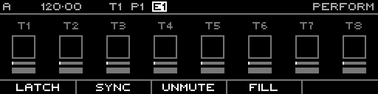

<!-- SPDX-FileCopyrightText: 2026 Axel Napolitano -->
<!-- SPDX-License-Identifier: CC-BY-NC-4.0 -->

# Performance

## Function

Collects performance-oriented controls intended for immediate use while the sequencer is running.

## Access

Hold `PERF` for temporary access or open the corresponding page through the page selector.

## Operation

The exact actions are shown in the footer and depend on the current project/track state.

From Munich with 
