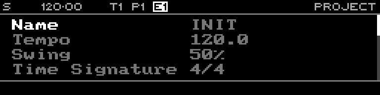

<!-- SPDX-FileCopyrightText: 2026 Axel Napolitano -->
<!-- SPDX-License-Identifier: CC-BY-NC-4.0 -->

# Project

## Function

Edits project-wide settings and provides project load/save operations.

## Access

Press `PAGE` + `T1` (`PROJECT`).

## Operation

List-page editing uses the encoder: select an item, press the encoder to enter edit mode, rotate to change it, then press again to leave edit mode.

The page covers the project name plus project-wide musical and recording settings such as Tempo, Swing, Time Signature, Sync Measure, Scale, Root Note, Monitor Mode, Record Mode, MIDI Input, CV Gate Input, and Curve CV Input.

`SHIFT` + `PAGE` opens project actions:

- **Init** — clear the current project after confirmation.
- **Load** — load a project slot from SD.
- **Save** — save to the current project slot; if no writable slot is assigned, Styr falls back to **Save As**.
- **Save As** — choose another project slot on SD.
- **Route** — available for routable rows such as **Tempo** and **Swing**.

Press the encoder on the **Name** row to open text entry.

From Munich with 
