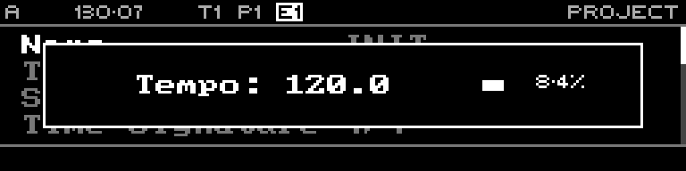

<!-- SPDX-FileCopyrightText: 2026 Axel Napolitano -->
<!-- SPDX-License-Identifier: CC-BY-NC-4.0 -->

# Tempo Nudge

## Function

Temporarily nudges the clock timing for beat matching without treating the nudge as a permanent tempo edit.

## Access

Hold `TEMP`, then hold the displayed left/right nudge control.

## Operation

Release the nudge control to return to normal clock timing; release `TEMP` to return to the previous page.

From Munich with 
