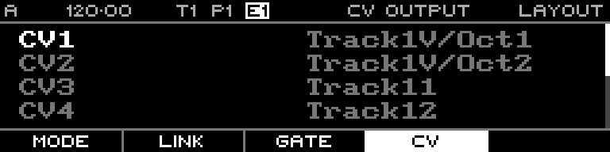

<!-- SPDX-FileCopyrightText: 2026 Axel Napolitano -->
<!-- SPDX-License-Identifier: CC-BY-NC-4.0 -->

# Layout — MIDI/CV Mapping Example

## Function

Shows a concrete CV mapping for a MIDI/CV track configured with multiple voices and pitch/velocity outputs.

## Access

Configure a MIDI/CV track, then open Layout → CV.

## Operation

Use this pattern as a reference when one MIDI/CV track needs several physical CV channels.

From Munich with 
