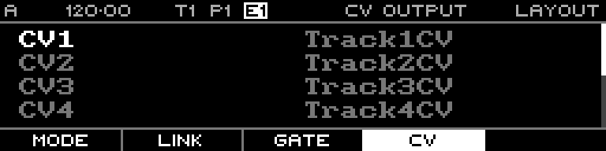

<!-- SPDX-FileCopyrightText: 2026 Axel Napolitano -->
<!-- SPDX-License-Identifier: CC-BY-NC-4.0 -->

# Layout — CV Output

## Function

Maps virtual track CV outputs to physical CV output jacks.

## Access

Open Layout and select the CV tab.

## Operation

The default mapping is one-to-one. Multiple logical outputs from one MIDI/CV track can be mapped to several physical outputs for polyphonic or modulation use.

From Munich with 
