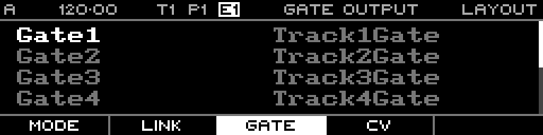

<!-- SPDX-FileCopyrightText: 2026 Axel Napolitano -->
<!-- SPDX-License-Identifier: CC-BY-NC-4.0 -->

# Layout — Gate Output

## Function

Maps virtual track gate outputs to physical gate output jacks.

## Access

Open Layout and select the Gate tab.

## Operation

The default mapping is one-to-one. Change it when a track’s logical gate should appear on another physical channel.

From Munich with 
