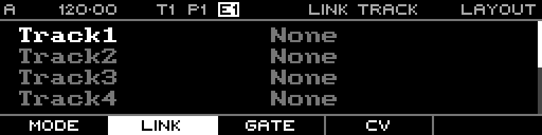

<!-- SPDX-FileCopyrightText: 2026 Axel Napolitano -->
<!-- SPDX-License-Identifier: CC-BY-NC-4.0 -->

# Layout — Link Track

## Function

Links a track to a preceding track so it follows that track’s playback behaviour.

## Access

Open Layout and select the Link tab.

## Operation

A track may link only to a preceding track. This preserves a one-directional dependency chain.

From Munich with 
