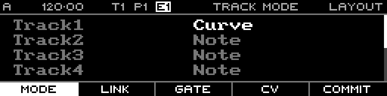

<!-- SPDX-FileCopyrightText: 2026 Axel Napolitano -->
<!-- SPDX-License-Identifier: CC-BY-NC-4.0 -->

# Layout — Confirm Track Mode

## Function

Confirms a staged track-mode change.

## Access

After choosing a different mode on the Track Mode tab, use the Commit/confirm function shown in the footer.

## Operation

Confirm only after checking the selected track; the mode change clears incompatible track data.

From Munich with 
