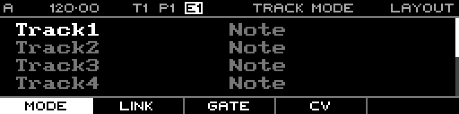

<!-- SPDX-FileCopyrightText: 2026 Axel Napolitano -->
<!-- SPDX-License-Identifier: CC-BY-NC-4.0 -->

# Layout — Track Mode

## Function

Assigns a track mode to each of the eight tracks. Changing mode changes the data model used by that track.

## Access

Press `PAGE` + `T2` (`LAYOUT`), then select the Track Mode tab.

## Operation

Select the desired track and choose its mode. A mode change is staged first because accepting it erases data associated with the previous mode.

From Munich with 
