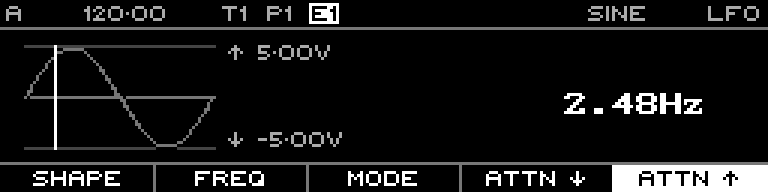

<!-- SPDX-FileCopyrightText: 2026 Axel Napolitano -->
<!-- SPDX-License-Identifier: CC-BY-NC-4.0 -->

# LFO — Free Overview

## Function

Shows the LFO in free-running mode, independent of the sequencer step grid.

## Access

Set LFO Mode to **Free**.

## Operation

The rate function changes from Steps to Frequency. The Min/Max documentation fixture remains -5.00 V/+5.00 V.

From Munich with 
