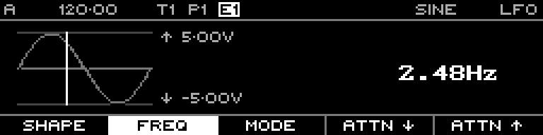

<!-- SPDX-FileCopyrightText: 2026 Axel Napolitano -->
<!-- SPDX-License-Identifier: CC-BY-NC-4.0 -->

# LFO — Frequency

## Function

Sets free-running LFO frequency.

## Access

In Free mode, press the rate function (`F2`).

## Operation

Frequency is stored in 0.01 Hz steps and is limited to 0.00–20.00 Hz.

From Munich with 
