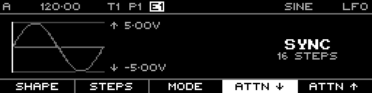

<!-- SPDX-FileCopyrightText: 2026 Axel Napolitano -->
<!-- SPDX-License-Identifier: CC-BY-NC-4.0 -->

# LFO — Min

## Function

Sets the lower LFO output limit.

## Access

On the LFO page, press `F4` / **Min**.

## Operation

The value is stored in 0.01 V units and supports -5.00 V through +5.00 V. Documentation captures use -5.00 V.

From Munich with 
