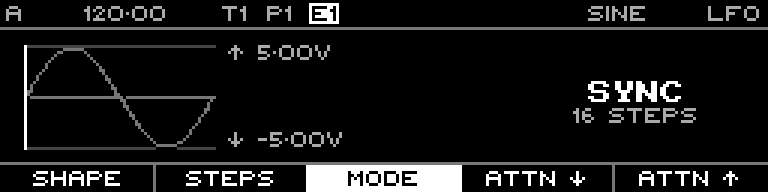

<!-- SPDX-FileCopyrightText: 2026 Axel Napolitano -->
<!-- SPDX-License-Identifier: CC-BY-NC-4.0 -->

# LFO — Mode

## Function

Switches between sequencer-synchronised and free-running operation.

## Access

On the LFO page, press `F3` / **Mode**.

## Operation

Choose **Sync** for step-synchronised movement or **Free** for frequency-based operation.

From Munich with 
