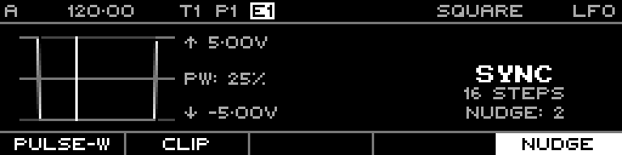

<!-- SPDX-FileCopyrightText: 2026 Axel Napolitano -->
<!-- SPDX-License-Identifier: CC-BY-NC-4.0 -->

# LFO — Nudge

## Function

Circularly offsets supported Sync waveforms against their step grid.

## Access

In Sync mode with Sine, Triangle, Ramp Up, Ramp Down or Square, hold `SHIFT` and select **Nudge**.

## Operation

Nudge is constrained by the current cycle length. Random and Noise waveforms do not use this control.

From Munich with 
