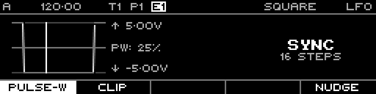

<!-- SPDX-FileCopyrightText: 2026 Axel Napolitano -->
<!-- SPDX-License-Identifier: CC-BY-NC-4.0 -->

# LFO — Pulse Width

## Function

Changes the Square waveform duty cycle.

## Access

Select Square, hold `SHIFT`, then select **Pulse W**.

## Operation

Pulse width is 0–100%. The documentation example uses a visibly asymmetric 25% duty cycle.

From Munich with 
