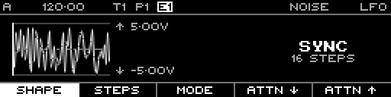

<!-- SPDX-FileCopyrightText: 2026 Axel Napolitano -->
<!-- SPDX-License-Identifier: CC-BY-NC-4.0 -->

# LFO Shape — Noise

## Function

Produces rapidly changing noise rather than a phase-continuous periodic waveform.

## Access

On the LFO page select **Shape**, then choose this waveform.

## Operation

The reference fixture uses **-5.00 V to +5.00 V** so the shape is shown at full display height.

## Notes

Noise capture seeding is reset by the documentation tool so regenerated documentation remains deterministic.

From Munich with 
