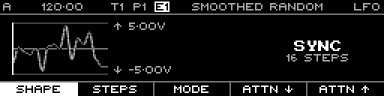

<!-- SPDX-FileCopyrightText: 2026 Axel Napolitano -->
<!-- SPDX-License-Identifier: CC-BY-NC-4.0 -->

# LFO Shape — Smoothed Random

## Function

Interpolates between random step values for continuous random modulation.

## Access

On the LFO page select **Shape**, then choose this waveform.

## Operation

The reference fixture uses **-5.00 V to +5.00 V** so the shape is shown at full display height.

From Munich with 
