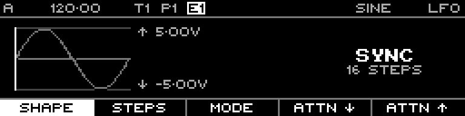

<!-- SPDX-FileCopyrightText: 2026 Axel Napolitano -->
<!-- SPDX-License-Identifier: CC-BY-NC-4.0 -->

# LFO — Shape

## Function

Selects the waveform used by the LFO.

## Access

On the LFO page, press `F1` / **Shape**.

## Operation

Turn the encoder while Shape is selected to choose the waveform. Each supported waveform has a separate reference page below.

From Munich with 
